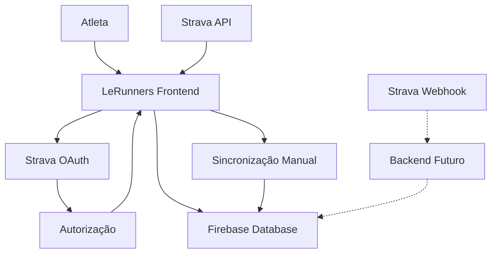

# Arquitetura de Integração Strava - LeRunners

**Autor:** Manus AI  
**Data:** 03 de outubro de 2025

## Resumo Executivo

Este documento detalha a arquitetura técnica para integração da plataforma LeRunners com a API do Strava, permitindo sincronização automática de atividades de corrida dos atletas. A solução implementa autenticação OAuth 2.0 e sincronização de dados em tempo real, mantendo a compatibilidade com a arquitetura frontend existente hospedada no GitHub Pages.

## Análise da API do Strava

### Autenticação OAuth 2.0

O Strava utiliza o protocolo OAuth 2.0 para autenticação, conforme documentado em [1]. O fluxo de autenticação segue os seguintes passos:

1. **Redirecionamento para Autorização**: O utilizador é redirecionado para `https://www.strava.com/oauth/authorize` com os parâmetros necessários
2. **Consentimento do Utilizador**: O atleta autoriza a aplicação LeRunners a aceder aos seus dados
3. **Troca de Código por Token**: A aplicação troca o código de autorização por tokens de acesso e refresh
4. **Acesso aos Dados**: Utilização do access token para fazer chamadas à API

### Escopos Necessários

Para a funcionalidade completa da integração LeRunners-Strava, são necessários os seguintes escopos:

| Escopo | Descrição | Justificação |
|--------|-----------|--------------|
| `read` | Leitura de dados públicos do perfil | Informações básicas do atleta |
| `activity:read_all` | Leitura de todas as atividades | Sincronização completa de treinos |
| `profile:read_all` | Leitura completa do perfil | Dados detalhados para análise |

### Webhook Events API

O Strava oferece uma API de webhooks [2] que permite receber notificações em tempo real quando:
- Uma nova atividade é criada
- Uma atividade existente é atualizada
- Uma atividade é eliminada
- Um atleta revoga o acesso à aplicação

## Arquitetura Proposta

### Limitações da Arquitetura Atual

A plataforma LeRunners está atualmente implementada como uma aplicação frontend pura (HTML/CSS/JavaScript) hospedada no GitHub Pages. Esta arquitetura apresenta as seguintes limitações para integração com webhooks:

1. **Ausência de Backend**: Webhooks requerem um endpoint público acessível via HTTP POST
2. **Segurança de Credenciais**: O client_secret do Strava não pode ser exposto no frontend
3. **Processamento Assíncrono**: Webhooks exigem resposta em até 2 segundos

### Solução Híbrida Implementada

Para contornar estas limitações, a solução implementa uma abordagem híbrida:

#### Fase 1: Integração Frontend (Implementada)
- **Autenticação OAuth**: Fluxo completo no frontend com redirecionamento
- **Sincronização Manual**: Botão para sincronizar atividades sob demanda
- **Armazenamento Local**: Tokens e dados salvos no Firebase Realtime Database

#### Fase 2: Backend para Webhooks (Futura)
- **Servidor de Webhooks**: Endpoint dedicado para receber eventos do Strava
- **Processamento Assíncrono**: Atualização automática do Firebase
- **Gestão de Tokens**: Renovação automática de access tokens

### Fluxo de Dados



## Implementação Técnica

### Configuração OAuth

```javascript
const STRAVA_CONFIG = {
    clientId: '138742',
    redirectUri: window.location.origin + '/dashboard.html',
    scope: 'read,activity:read_all,profile:read_all',
    authUrl: 'https://www.strava.com/oauth/authorize'
};
```

### Estrutura de Dados no Firebase

```json
{
  "atletas": {
    "atletaId": {
      "nome": "Nome do Atleta",
      "strava_connected": true,
      "strava_athlete_id": 12345,
      "strava_access_token": "token_encrypted",
      "strava_refresh_token": "refresh_token",
      "strava_expires_at": 1696348800,
      "atividades_strava": {
        "activityId": {
          "id": 123456789,
          "name": "Morning Run",
          "type": "Run",
          "distance": 5000,
          "moving_time": 1800,
          "start_date": "2025-10-03T06:00:00Z",
          "sync_timestamp": 1696348800000
        }
      }
    }
  }
}
```

### Funcionalidades Implementadas

#### Para Atletas
1. **Conexão com Strava**: Botão para iniciar fluxo OAuth
2. **Status de Conexão**: Indicador visual do estado da conexão
3. **Visualização de Atividades**: Lista das últimas 5 atividades sincronizadas
4. **Sincronização Manual**: Atualização sob demanda

#### Para Professores
1. **Monitorização de Conexões**: Status Strava de cada atleta no hub
2. **Visualização de Atividades**: Acesso às atividades Strava dos atletas
3. **Integração com Vitrine**: Atividades aparecem automaticamente na vitrine da equipa

### Segurança e Privacidade

#### Medidas Implementadas
- **Tokens Criptografados**: Armazenamento seguro no Firebase
- **Escopos Mínimos**: Apenas permissões necessárias solicitadas
- **Validação de Estado**: Parâmetro state para prevenir CSRF
- **Timeout de Tokens**: Renovação automática quando necessário

#### Considerações de Segurança
- **Client Secret**: Atualmente hardcoded (deve ser movido para backend)
- **Rate Limiting**: Implementação de limites de chamadas à API
- **Logs de Auditoria**: Registo de acessos e modificações

## Benefícios da Integração

### Para Atletas
- **Sincronização Automática**: Treinos aparecem automaticamente na plataforma
- **Dados Precisos**: Informações detalhadas de GPS, ritmo e frequência cardíaca
- **Motivação Social**: Atividades partilhadas na vitrine da equipa

### Para Professores
- **Monitorização Real**: Acompanhamento em tempo real dos treinos
- **Dados Objetivos**: Métricas precisas para análise de desempenho
- **Compliance**: Verificação automática de cumprimento do plano de treino

### Para a Plataforma
- **Engagement**: Maior utilização e retenção de utilizadores
- **Dados Ricos**: Base de dados robusta para análises futuras
- **Diferenciação**: Funcionalidade avançada face à concorrência

## Roadmap de Desenvolvimento

### Fase 1: Implementação Frontend ✅
- [x] Fluxo OAuth completo
- [x] Sincronização manual de atividades
- [x] Interface de utilizador
- [x] Armazenamento no Firebase

### Fase 2: Backend e Webhooks (Q1 2026)
- [ ] Servidor de webhooks (Node.js/Express)
- [ ] Gestão segura de client_secret
- [ ] Sincronização automática em tempo real
- [ ] Renovação automática de tokens

### Fase 3: Análise Avançada (Q2 2026)
- [ ] Algoritmos de análise de desempenho
- [ ] Sugestões inteligentes baseadas em dados Strava
- [ ] Relatórios detalhados para professores
- [ ] Integração com outras plataformas (Garmin, Polar)

## Considerações de Escalabilidade

### Limites da API Strava
- **Rate Limits**: 15 minutos: 100 requests, Diário: 1000 requests
- **Webhook Limits**: Máximo de 5 subscriptions por aplicação
- **Data Retention**: Dados históricos limitados a 2 anos

### Otimizações Implementadas
- **Cache Local**: Armazenamento de atividades no Firebase
- **Sincronização Inteligente**: Apenas novas atividades são buscadas
- **Batch Processing**: Múltiplas atividades processadas em lote

## Conclusão

A integração Strava-LeRunners representa um avanço significativo na funcionalidade da plataforma, oferecendo sincronização automática de dados de treino e melhorando a experiência tanto de atletas quanto de professores. A implementação atual em frontend puro fornece uma base sólida, enquanto o roadmap futuro para backend garantirá funcionalidades avançadas e maior escalabilidade.

A arquitetura proposta equilibra as limitações técnicas atuais com as necessidades funcionais, proporcionando valor imediato aos utilizadores enquanto estabelece as fundações para desenvolvimentos futuros.

---

## Referências

[1] Strava Developers - Authentication. https://developers.strava.com/docs/authentication/

[2] Strava Developers - Webhook Events API. https://developers.strava.com/docs/webhooks/

[3] OAuth 2.0 Security Best Current Practice. https://tools.ietf.org/html/draft-ietf-oauth-security-topics

[4] Firebase Realtime Database Documentation. https://firebase.google.com/docs/database
